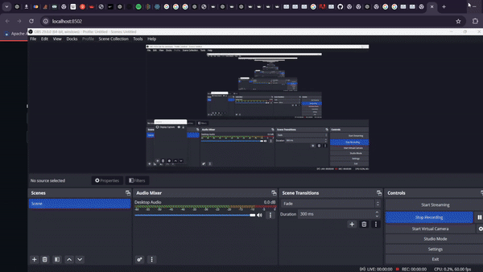

# 📧 Cold Email Generator Web App

## Overview
The Cold Email Generator is a Python-based web application utilizing the Llama LLM model. It is specifically designed for service-based companies seeking to generate customized cold emails for contract job postings.

## Problem Statement
Service-based companies often need to reach out to multiple organizations for contract roles, which can be time-consuming. This app streamlines the process of creating personalized cold emails, enabling companies to efficiently respond to numerous job postings daily.

## Features

- **Automated Cold Email Generation**: Input a job post URL, and the app generates tailored cold emails.
- **Custom Tech Stack and Portfolio**: Users can input their tech stack and portfolio dataset to ensure relevance in email outreach.
- **User-Friendly Interface**: Simple and intuitive design for easy navigation.

## How It Works

- **Setup**: Companies can input their tech stack and portfolio links into the app.
- **Job Posting URL**: Enter the URL of the job post for which you want to generate a cold email.
- **Email Generation**: Submit the URL, and the app will generate a cold email tailored to the job post.
- **Customization**: Users can further curate the generated email before sending it.



## Sample Dataset
For testing purposes, the app includes a sample dataset from the company CronAi, featuring its tech stack and portfolio links.

## Technologies Used
- Python
- Pandas
- Streamlit
- LangChain
- WebBaseLoader
- Meta Llama 3.1 70b LLM Model

### Getting Started

1. Clone the repository:
    ```bash
    git clone https://github.com/mShubham18/Cold-Email_Generator.git
    cd <your-cloned-repository-directory>
    ```
2. Install required packages:
    ```bash
    pip install -r requirements.txt
    ```
3. Run the app:
    ```bash
    streamlit run app/app.py
    ```